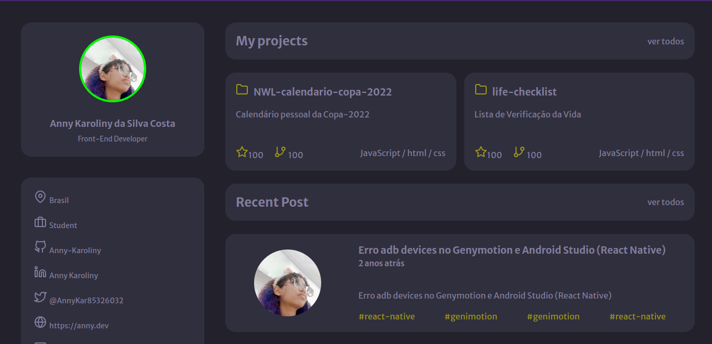

<h1 align="center">Portifólio - Anny Karoliny</h1>

My personal portifolio

  <a href="#-tecnologias">Tecnologias</a>&nbsp;&nbsp;&nbsp;|&nbsp;&nbsp;&nbsp;
  <a href="#-projeto">Projeto</a>&nbsp;&nbsp;&nbsp;|&nbsp;&nbsp;&nbsp;
  <a href="#-layout">Layout</a>&nbsp;&nbsp;&nbsp;|&nbsp;&nbsp;&nbsp;
  <a href="#memo-licença">Licença</a>

  

 

  

## 🚀 Tecnologias

Esse projeto foi desenvolvido com as seguintes tecnologias:

- HTML 
- CSS
- Git e Github

## 💻 Projeto

Este projeto é a versão inicial de um portifólio 

## 🔖 Layout

O layout base desse projeto foi desenvolvido pela Rocketseat

##  Licença

Esse projeto está sob a licença MIT.

---

Feito com ♥ by Anny :wave: 
